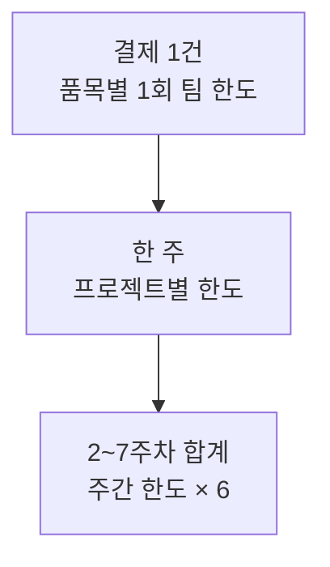
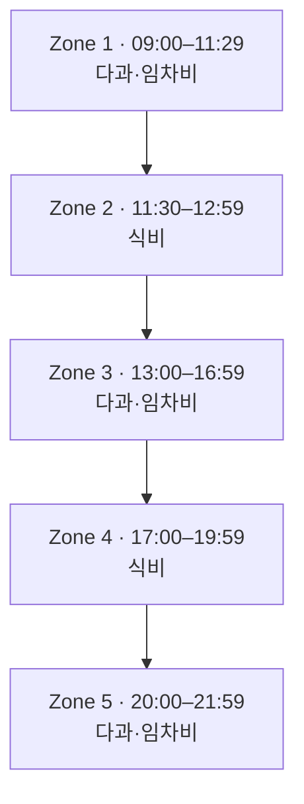

결제하기 전에 예산, 결제수단, 품목, 시간을 확인해요. 네 가지가 모두 맞아야 결제할 수 있습니다.

이 문서는 2608 일경험 운영 기준입니다. 이전 기수에서 허용된 방식은 기준이 아닙니다.

## 전체 예산

팀활동비는 팀별 180만 원입니다. 주간 한도는 **2주차부터 7주차까지 6주** 동안 적용됩니다.

주간 한도는 프로젝트마다 다릅니다. 소속 프로젝트의 한도를 반드시 확인해요.

| 프로젝트 | 조정 사유 | 주간 한도 | 6주 합계 |
| --- | --- | ---: | ---: |
| 리서치 | 기존 기준 유지 | 20만 원 | 120만 원 |
| 신탁 | 기존 기준 유지 | 20만 원 | 120만 원 |
| ECM | 1주차 사용기간 부족 | 23만 원 | 138만 원 |
| 법인영업 | 1주차 사용기간 부족 | 23만 원 | 138만 원 |
| 리스크관리 | 1주차 사용기간 부족 | 23만 원 | 138만 원 |
| 연금상품 | 1주차 사용기간 부족 | 23만 원 | 138만 원 |
| 해외증권 | 1주차 사용기간 부족 | 23만 원 | 138만 원 |
| DCM | 사용기간 부족 + AI 미구독 | 26만 원 | 156만 원 |
| 디지털 서비스 | 사용기간 부족 + AI 미구독 | 26만 원 | 156만 원 |
| 부동산금융 | 사용기간 부족 + AI 미구독 | 26만 원 | 156만 원 |

한도를 조정한 이유는 이렇습니다. 활동비가 8월 24일에 지급되어 일부 프로젝트는 2회차 미팅 전까지 쓸 수 있는 기간이 1~4일뿐이었습니다. 그래서 1주차 활동비 20만 원을 2~7주차에 나누어 반영했습니다. AI 구독을 하지 않는 프로젝트는 미사용 구독비 20만 원도 함께 반영했습니다.

주간 한도는 최대 금액이고 전액을 써야 하는 것은 아닙니다. 프로젝트별 총예산 180만 원은 바뀌지 않습니다.

**8주차 인쇄비 20만 원은 주간 한도와 별도로 운영됩니다.**

지급은 팀장 명의의 모임통장(팀 공용 계좌)으로 합니다. 4주 단위로 90만 원씩 두 번 들어옵니다.

활동비는 먼저 지급되므로 잔액을 직접 관리해야 합니다. 매주 팀원 전원이 거래내역과 잔액을 확인하고 지출결과서에 서명해요.

<Accordion title="왜 팀원 전체가 확인하나요?">
  활동비는 개인이 아니라 팀에 지급되는 공동 예산입니다. 주간 담당자가 서류를 작성해도 계획과 결제, 잔액은 팀원 전원이 확인해야 합니다. 카드를 개인적으로 사용했거나 팀원이 내역을 확인하지 않으면 팀 전체에 공동 책임이 적용됩니다.
</Accordion>

## 한도는 세 층으로 걸려요

결제 한 건에는 품목별 1회 팀 한도가 걸립니다. 한 주 합계는 소속 프로젝트의 주간 한도를 넘을 수 없습니다. 6주 합계는 주간 한도의 6배입니다.

하루 합계 한도는 없습니다. 하루에 주간 한도를 모두 사용해도 됩니다.

한도를 넘으면 초과 금액은 팀원이 공동 부담해 환급합니다. 다음 주부터 활동비 사용이 제한될 수 있습니다.

### 품목별 1회 한도

팀 한도는 4인 기준입니다.

| 구분 | 사용처 | 1회 팀 한도 | 1회 1인 기준 |
| --- | --- | ---: | ---: |
| 식비 | 일반음식점 | 6만 원 | 1만 5천 원 |
| 다과 | 카페 등 휴게음식점 | 4만 원 | 1만 원 |
| 임차비 | 스터디카페 | 4만 원 | 1만 원 |

## 지정 카드로만 결제해요

지정 카드(모임통장에 연결하고 카드번호를 등록한 카드)로만 결제해요. 계좌이체는 쓸 수 없어요. 개인카드로 먼저 결제한 뒤 환급받는 것도 안 됩니다.

카드를 발급하면 운영팀이 안내한 방식으로 카드번호를 등록해요.

<Accordion title="왜 지정 카드만 쓰나요?">
  지정 카드를 사용하면 지출결과서, 통장 거래내역, 영수증을 같은 결제 건으로 대조할 수 있습니다. 결제 수단이 섞이면 실제 사용 내역을 증명하기 어려워집니다.
</Accordion>

## 쓸 수 있는 시간을 확인해요

타임존(하루를 나눈 5개 결제 시간대)마다 쓸 수 있는 품목이 정해져 있습니다.

각 타임존에서는 지정된 품목으로 한 번만 결제할 수 있습니다. 같은 타임존에서 두 번 결제하면 한 건만 인정됩니다. 22시 이후 결제는 인정되지 않습니다.

## 인정되지 않는 결제

아래 결제는 인정되지 않고, 사용액은 환급 대상입니다.

- 세부 품목이 보이지 않는 영수증, 영수증 누락
- 주류, 다과비로 구매한 텀블러 등 물품
- 1회 팀 한도를 넘기려고 같은 품목을 나누어 결제
- 팀원 일부만 참여한 비용
- 식비를 배달앱으로 결제, 스터디카페를 예약 결제
- 승인받지 않은 날짜, 타임존, 품목, 금액으로 결제

타임존이 다른 결제를 하루에 여러 건 하는 것은 정상 사용입니다.

<Warning>
  사용 가능 여부가 애매하면 결제 전에 커리어하이에 문의하세요. 결제는 되돌릴 수 없고, 인정되지 않은 금액은 팀이 환급합니다.
</Warning>

## 결제 전후에 확인해요

### 결제 전

- [ ] 커리어하이의 승인 안내를 받았음
- [ ] 승인된 날짜와 타임존이 맞음
- [ ] 승인된 품목과 목적이 맞음
- [ ] 결제 1건이 품목별 1회 팀 한도 이하임
- [ ] 이번 주 합계가 소속 프로젝트의 주간 한도 이하임
- [ ] 2~7주차 누적이 주간 한도 × 6 이하임
- [ ] 팀원 전원이 함께 쓰는 지출임
- [ ] 지정 카드를 사용함

승인 내용과 실제 결제가 달라지면 결제 전에 운영팀 안내를 받아요.

### 결제 후

1. 영수증에 날짜, 가맹점, 세부 품목, 금액이 보이는지 확인해요.
2. 글자가 선명하게 보이도록 촬영해요.
3. 거래내역과 영수증 금액을 대조해요.
4. 지출결과서에 사용 내역을 바로 기록해요.
5. 팀원 전원이 잔액을 확인하고 서명해요.

## 기준을 지키지 않으면

인정되지 않은 금액은 팀이 환급합니다. 주간 한도를 넘으면 다음 주부터 활동비를 사용할 수 없습니다. 개인 사용처럼 중대한 위반은 참여 중단 사유입니다.

제출 오류와 규정 위반은 평가에 반영됩니다. 어떤 항목이 반영되는지는 [감점 기준](/team-activity/expenses/deduction-criteria)에서 확인해요.

<Card title="다음: 팀 공용폴더 만들기" icon="folder-plus" href="/team-activity/expenses/shared-folder">
  지출품의서와 지출결과서를 관리할 팀 폴더를 준비하세요.
</Card>
